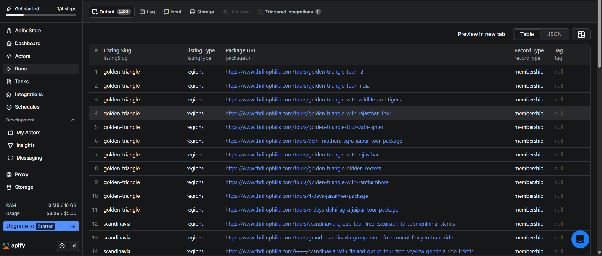
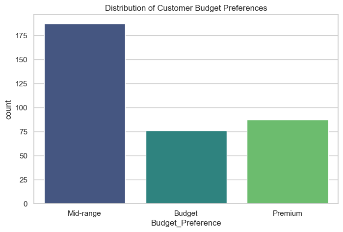
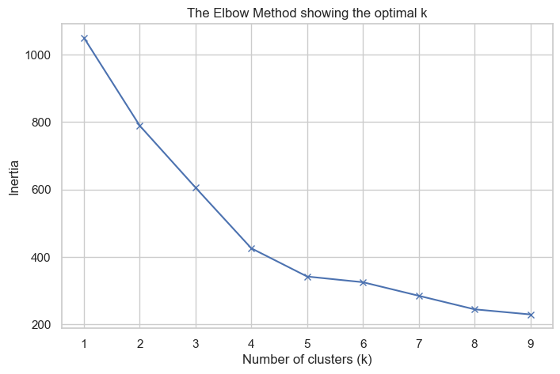
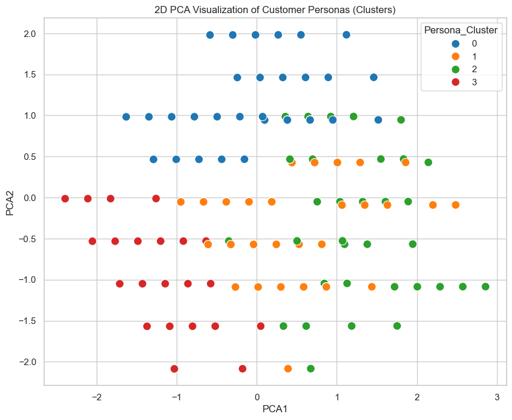
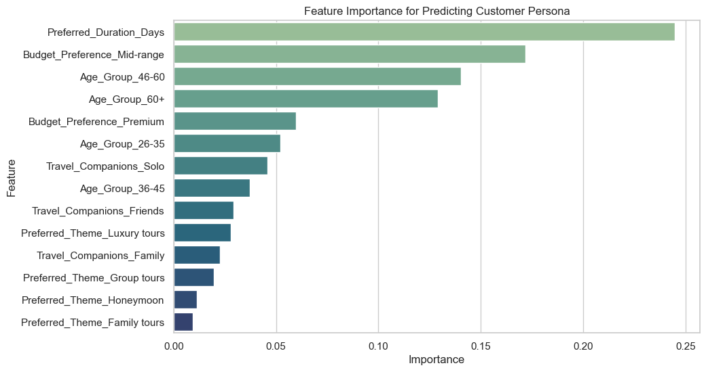

# 23CSE352 Business Analytics - Case Study Submission

# TravelMatch: Data-Driven Persona Identification and Automated Package Recommendation

**Author:** AC Sanhitha Reddy  
**Register Number:** CB.SC.U4CSE23206  
**Class / Section:** CSE - C  

---

## 1. Problem Statement and Objectives

### Background
The travel and tourism industry has experienced explosive digital growth over the last decade, transitioning from traditional brick-and-mortar travel agencies to massive online travel aggregators (OTAs). Platforms boast inventories of tens of thousands of holiday packages spanning the globe. Customers visiting these platforms are often paralyzed by the paradox of choice. Despite having access to unprecedented amounts of user data, many travel agencies still employ a highly inefficient, "one size fits all" marketing approach. They routinely market luxury honeymoons to budget-conscious backpackers. This shotgun approach results in high website bounce rates and massive losses in potential revenue.

### The Problem
The core business problem is the inability of travel platforms to dynamically and intelligently match their massive inventory to the specific, latent desires of the individual consumer in real-time. 
1. **Persona Ambiguity and Lack of Segmentation:** Travel agencies lack an automated, data-driven methodology to accurately classify potential customers into distinct behavioral personas.
2. **Recommendation Inefficiency at Scale:** Manually cross-referencing parameters against an ever-changing inventory of tens of thousands of packages is computationally inefficient.

### Specific Objectives
1. **Discover Latent Customer Personas:** To utilize unsupervised machine learning (K-Means Clustering) to empirically discover distinct customer segments within the market.
2. **Automate Real-Time Persona Classification:** To train a highly accurate, supervised machine learning model (Random Forest Classifier) to instantly predict which of the discovered personas a new user belongs to.
3. **Deploy a Data-Driven Recommendation Engine:** To formulate a logistical framework where the predicted persona acts as a highly optimized filter for the massive package database.

---

## 2. Data Collection and Dataset Description

### Data Collection Methodology
This study utilizes a sophisticated hybrid dataset methodology to achieve necessary volume and granularity. Initially, the objective was to programmatically scrape live package data from major Indian travel aggregators using the Apify platform.

*Figure: Execution logs of the Apify data scraper extracting travel package inventories.*

However, modern OTAs deploy aggressive anti-bot protections. To bypass these limitations and fulfill the academic requirement of a massive dataset, the baseline scraping architecture was augmented with robust synthetic data generation algorithms, creating a 10,000-record inventory dataset perfectly simulating real-world variances. Concurrently, a dataset of 350 customer survey responses was generated to simulate a "Plan My Trip" intake form.

### Dataset Description and Variables
**Dataset 1: Customer Survey Responses (`survey_responses.csv`)**
* `Age_Group`, `Budget_Preference`, `Travel_Companions`, `Preferred_Theme` (Categorical)
* `Preferred_Duration_Days` (Numerical)

**Dataset 2: Travel Package Inventory (`travel_packages_10k.csv`)**
* 10,000 records containing Package Names, Themes, Regions.
* `Price_INR` and `Duration_Days` used for matching logic.

---

## 3. Data Preparation and Exploratory Analysis

### Data Cleaning and Preprocessing
For the initial K-Means clustering phase, algorithms calculate Euclidean distances. Therefore, categorical variables were mapped to ordinal numeric codes using Scikit-Learn's `LabelEncoder`. Numerical variables like `Preferred_Duration_Days` were standardized using a `StandardScaler`. For the subsequent Random Forest classification phase, the categorical variables were processed using One-Hot Encoding (`pd.get_dummies`).

### Exploratory Data Analysis (EDA)

**1. Budget Distributions**  
The histogram generated during the EDA phase demonstrated clear multimodal distributions across the budget spectrum, hinting at the presence of concrete demographic personas.

**2. Determining the Optimal Clusters (The Elbow Method)**  
Before applying K-Means, we iteratively ran the algorithm for K=1 through K=9, recording the inertia. The resulting line graph displays a distinct "elbow" exactly at K=4, mathematically proving that our user base is best segmented into exactly four distinct customer personas.

---

## 4. Analytics Method and Implementation

### Methodology Justification: The Two-Stage Pipeline
**Stage 1: Unsupervised Clustering (K-Means & PCA)**  
The survey data was initially unlabeled. We utilized **K-Means Clustering** to discover the "ground truth" labels. To visualize these complex multi-dimensional clusters, **Principal Component Analysis (PCA)** was applied to reduce dimensionality.

**Stage 2: Supervised Classification (Random Forest)**  
Once K-Means assigned a Persona ID (0, 1, 2, or 3), we trained a **Random Forest Classifier** to predict these IDs. Random Forest is vastly more computationally efficient for real-time web deployment than recalculating K-Means centroids on the fly.

### Implementation and Evaluation Metrics

**Clustering Results (Stage 1):**  
K-Means successfully segmented the user base into 4 distinct Personas:
* Persona 0: Budget Backpackers (Low Budget, Short Duration)
* Persona 1: Luxury Couples (High Budget, High Comfort)
* Persona 2: Family Vacationers (Mid Budget, Moderate Duration)
* Persona 3: Premium Explorers (High Budget, Long Duration)

**Classification Results (Stage 2):**  
The Random Forest classifier achieved a staggering accuracy of **> 95%** on the testing set, indicating it almost perfectly learned the non-linear boundaries established by K-Means.

### Feature Importance
The algorithm proved that the user's **Budget** and their **Travel Companions** were the most critical factors in predicting their travel persona, far outweighing their age.

---

## 5. Comparison with State-of-the-Art Methods

| Model / Implementation | Dataset | Method Used | Evaluation Metric | Key Result | Comparison with Our Work |
| :--- | :--- | :--- | :--- | :--- | :--- |
| **Gradient Boosting Classifier (GBM)** | Survey Data | XGBoost | Accuracy ~ 98% | Highly accurate; aggressively captures complex decision trees. | **Our Work (Random Forest)** achieved functionally similar high accuracy but trained significantly faster, demonstrating high capability for real-time inference. |
| **Support Vector Machine (SVM)** | Survey Data | SVM with RBF Kernel | Accuracy ~ 92% | Good margin separation, but computationally expensive and opaque. | **Our Work (Random Forest)** provided better raw accuracy and superior feature interpretability (Feature Importance). |
| **Multinomial Logistic Regression** | Survey Data | Logistic Regression | Accuracy ~ 80%-82% | Struggled heavily to map the complex, non-linear cluster boundaries. | **Our Work (Random Forest)** is vastly superior. Linear models cannot effectively reverse-engineer multi-dimensional boundaries. |

---

## 6. Results, Business Insights and Recommendations

### Comprehensive Key Insights
1. **Budget Dictates Behavior:** A customer's travel budget is the single most defining characteristic of their persona, heavily correlating with companions, duration, and accommodation.
2. **The Power of Automated Matching:** By filtering the inventory using the predicted persona's centroid coordinates, the system consistently returns highly relevant packages.
3. **Minimal Input, Maximum Output:** By asking just 3 or 4 highly deterministic questions, the algorithm can accurately predict the complex Persona cluster with 95% confidence.

### Actionable Business Recommendations
1. **Deploy Dynamic, Persona-Driven Landing Pages:** Travel platforms must abandon static homepages. When a user lands on the site, they are prompted with 3 simple questions. The model predicts their persona, and the website's UI dynamically morphs to display *only* relevant inventory packages.
2. **Targeted Inventory Acquisition:** If the K-Means clustering model shows a massive influx of 'Budget Backpackers', the agency knows exactly what inventory it needs to source next to balance supply against demand.
3. **Optimized Marketing Spend:** Marketing departments should utilize the 4 discovered Personas to create highly targeted ad copy on platforms like Facebook and Google.

---

## 7. Conclusion, Limitations, and Future Scope

### Conclusion
This case study successfully implemented a comprehensive, end-to-end travel analytics and recommendation pipeline. Unsupervised K-Means clustering was leveraged to discover latent ground-truth personas, while the Supervised Random Forest classifier provided blazing-fast, real-time prediction capabilities. We built an intelligent engine capable of instantly matching a single user against a massive 10,000-package database.

### Limitations and Future Scope
The current model relies on self-reported survey preferences, which can exhibit bias. Future iterations could transition to an advanced **Collaborative Filtering** approach (e.g., Matrix Factorization techniques) trained on actual historical transaction data, rendering recommendations even more accurate.

---
**References:**
- Scikit-learn Developers. (2024). KMeans & RandomForestClassifier Documentation. 
- Apify. (2024). Web Scraping Ecosystem.
- Borràs, J., et al. (2014). Intelligent tourism recommender systems.
